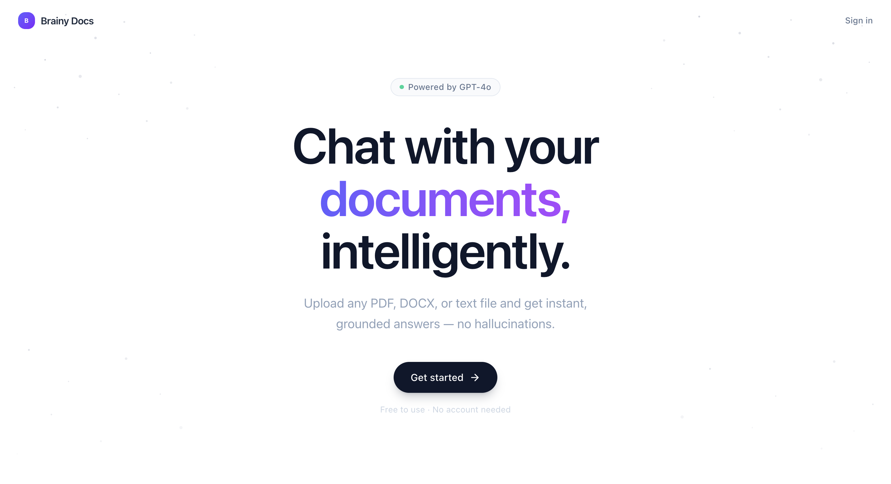
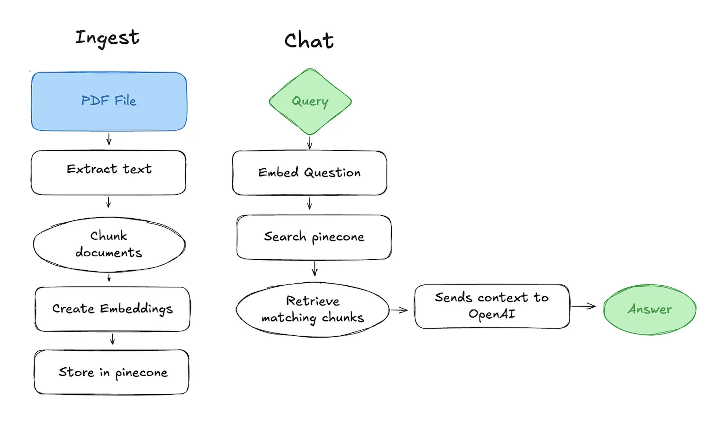

### BrainyDocs: AI-Powered Document Chat

[](https://nodejs.org/)
[](https://www.typescriptlang.org/)
[](https://openai.com/)
[](https://www.pinecone.io/)




### Project Overview

BrainyDocs is an AI-powered document chat application.  It upload PDFs and ask questions in natural language, powered by embeddings and vector search and intelligently splits documents into overlapping chunks to give context-aware answers.

- **OpenAI `text-embedding-3-small`** for generating embeddings
- **Pinecone** as a high-performance vector database
- **TypeScript & Node.js** for a clean backend



### Features

- Upload and parse PDFs  
- Convert text to vector embeddings  
- Store embeddings in Pinecone  
- Query documents with natural language  
- Chunk text intelligently for better answers  

### Installation

1. Clone the repo:

```bash
git clone https://github.com/<your-username>/brainydocs.git
cd brainydocs
```

2. Install dependencies:

```bash
npm install
```

3. Create a `.env` file in the root:

```env
OPENAI_API_KEY=your_openai_api_key
PINECONE_API_KEY=your_pinecone_api_key
PINECONE_INDEX_NAME=your_index_name
```

### Running the Project

###  Ingest PDFs (generate embeddings and populate Pinecone)

```bash
npm run ingest
```

### Chat with your documents

```bash
npm run chat
```

You can now type questions in the terminal and get AI-powered answers from your uploaded documents.

### Project Structure

```text
doc-chat/
├─ src/
│  ├─ ingest.ts        # PDF ingestion & embedding generation
│  ├─ chat.ts          # Interactive chat CLI
│  ├─ utils.ts         # Helper functions (chunking, embedding)
├─ docs/
│  └─ diagram.png      # Architecture diagram
├─ package.json
├─ tsconfig.json
└─ .env.example
```

### Tips
- Keep chunk size and overlap balanced for best results.  
- Make sure your Pinecone index dimension matches the embedding size (1536).  
- Use TypeScript’s strict mode for type-safe embeddings.  

### Next steps
Contributions are welcome! Open a PR or issue. Some ideas:
- Add multi-document support  
- Build a web UI  
- Improve chunking strategy
